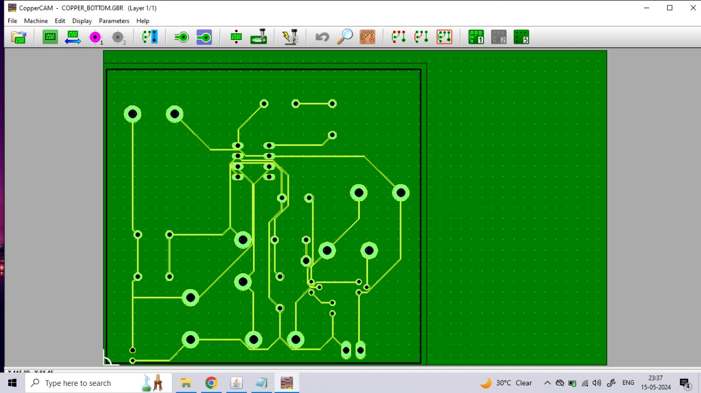
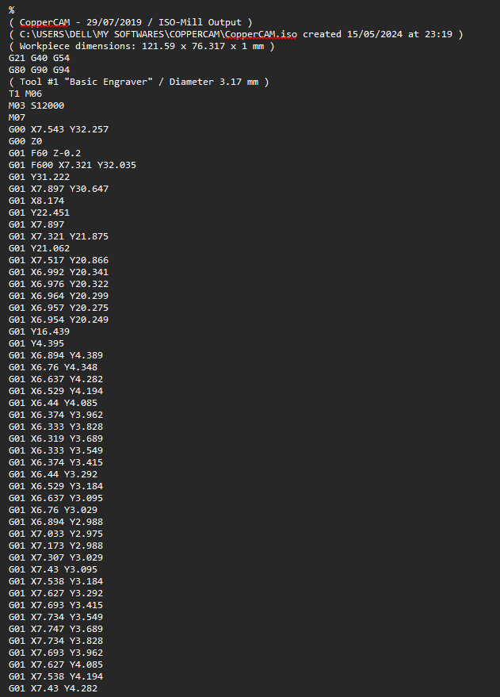
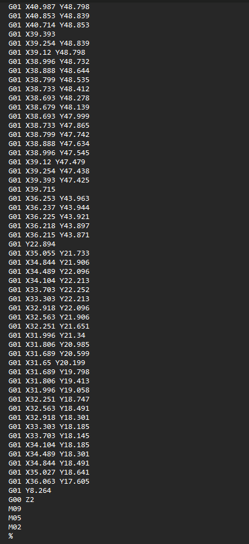
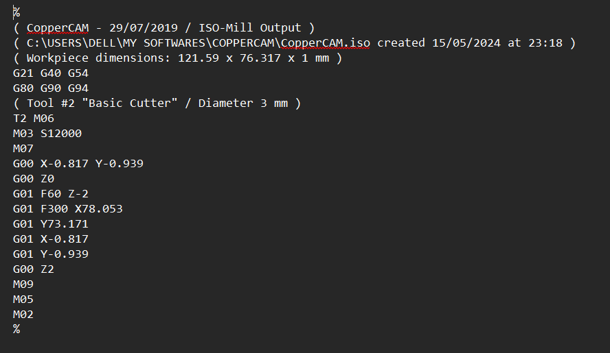

# Gerber-to-G-Code-Conversion
# Aim
To convert the Gerber File into G-Code using Copper CAM.
# Software required
Copper CAM
# Procedure
1. Open your Gerber file (File → Open → New circuit) 
2. Open your Drill file (File → Open → Drill) 
3. Match the drill file and engraving file if not matched  
4. Right click the pad and set define as pad and then Right click and select edit all identical pads as set the drill size as 0.8mm,1mm. 
5. Open your Cutting file (File → Open → Additional Layer and load your cutting file 
6. Go to file/Orgin and set x=0,y=0  
7. Go to file/offset and select the option shift manually 
8. Select the layer 6 and move the cutting file and set the border 
9. Go to parameter/ tool library and check the identifaication and specification 
10. Go to parameter/selected tool and check the engraving tool, cutting tool and drill tool 
11. Go to machine/ Contours/calculate Contours 
12. Go to machine/mill and select engraving you will get the g code,similarly for Drill and cut.  
13. Save the G code 
# Contours Output

# G Code
### Engraving G Code

### Drill G Code

#### Drill_0.8 G-Code

#### Drill_1 G-Code

### Cutting G Code

# Result

Thus the Gerber File into G-Code using Copper CAM.
